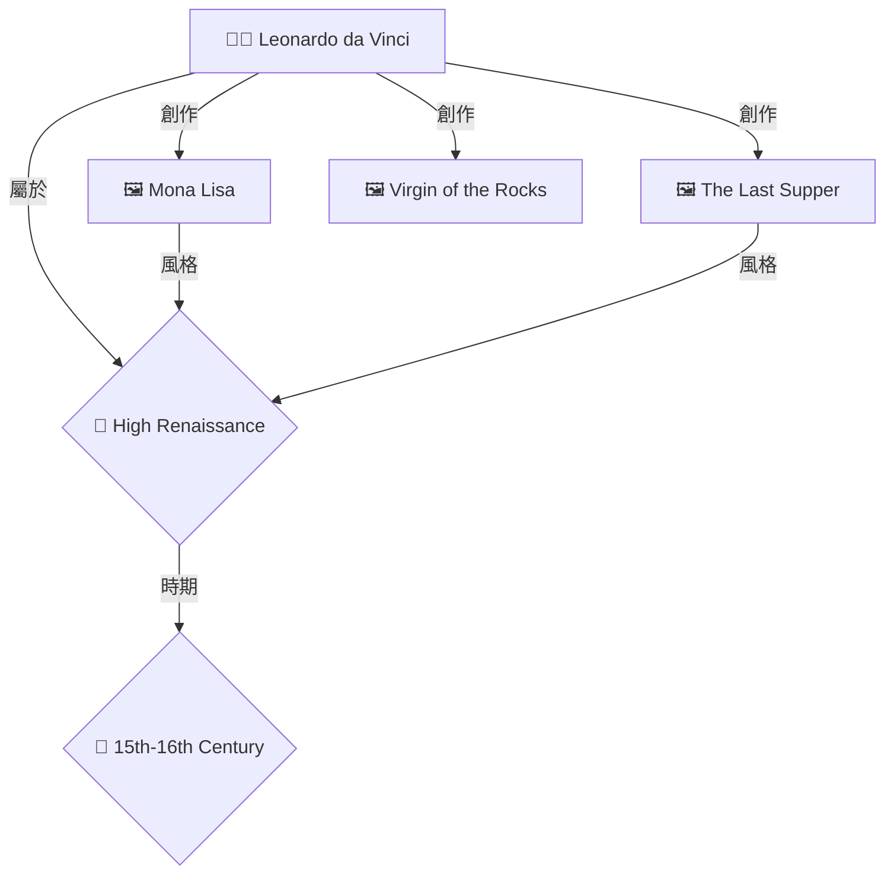
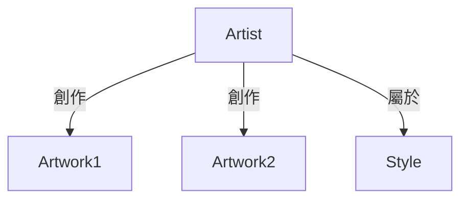
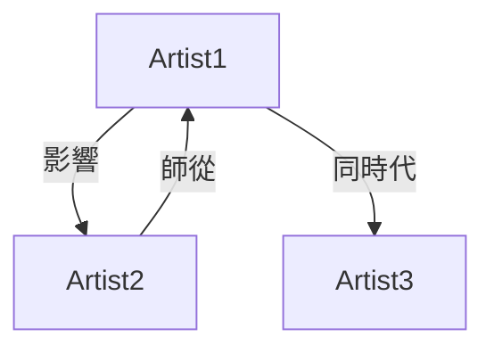
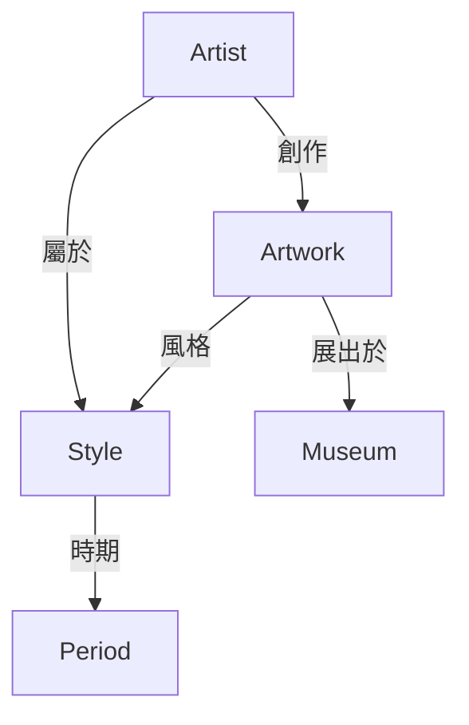

# 🎉 OpenWebUI Neo4j 圖譜視覺化功能 - 完成報告

## 📋 項目概述

成功實現了在 OpenWebUI 問答系統中顯示 Neo4j 知識圖譜的視覺化功能,讓用戶在進行藝術史知識問答時可以直觀地看到實體之間的關係。

**完成日期**: 2025-11-27
**版本**: v6.0.0

---

## ✅ 已實現功能

### 1. 核心功能

- ✅ **自動圖譜提取**: 從 RAG 檢索結果自動提取相關實體
- ✅ **Neo4j 圖譜查詢**: 查詢實體間的關係(支持1-2層深度)
- ✅ **Mermaid 視覺化**: 使用 Mermaid 圖表語法在 OpenWebUI 中渲染
- ✅ **智能實體分類**: 不同類型實體使用不同圖標和樣式
  - 👨‍🎨 藝術家 (Artist)
  - 🖼️ 藝術品 (Artwork)
  - 🎨 藝術風格 (Style)
  - 📅 時代/時期 (Period)
- ✅ **關係類型中文化**: 自動翻譯關係類型(創作/影響/屬於等)
- ✅ **性能優化**: 限制節點(20個)和關係(30條)數量保持可讀性

### 2. 整合功能

- ✅ 與現有 RAG 系統無縫整合
- ✅ 支持多種 LLM 模型 (9種)
- ✅ 支持多種 RAG 策略 (8種)
- ✅ 自動服務發現和故障轉移
- ✅ 完整的錯誤處理和狀態提示

### 3. 用戶體驗

- ✅ 清晰的圖例說明
- ✅ 圖譜統計信息(節點數、關係數)
- ✅ 檢索來源追蹤
- ✅ 系統信息展示
- ✅ 響應式進度提示

---

## 📦 交付文件

### 主要文件

1. **`enhanced_openwebui_rag_function_v6_with_graph_viz.py`**
   - OpenWebUI 函數主文件
   - 包含完整的圖譜查詢和視覺化邏輯
   - 支持 9×8=72 種模型組合

2. **`OpenWebUI_圖譜視覺化配置指南.md`**
   - 詳細配置說明
   - 自定義選項說明
   - 故障排除指南
   - 進階功能說明

3. **`啟動圖譜視覺化功能.md`**
   - 快速開始指南
   - 測試步驟
   - 預期輸出示例
   - 故障排除清單

4. **`test_graph_visualization.py`**
   - 自動化測試腳本
   - Neo4j 連接測試
   - 圖譜查詢測試
   - 數據庫狀態檢查

5. **`graph_visualization_demo.html`**
   - 互動式演示頁面
   - 多個圖譜示例
   - Neo4j 連接測試
   - Cypher 查詢示例

---

## 🚀 快速開始

### 第一步: 測試系統

```bash
# 進入項目目錄
cd art-history-database

# 運行測試腳本
python test_graph_visualization.py
```

### 第二步: 查看演示

```bash
# 在瀏覽器中打開演示頁面
open graph_visualization_demo.html
# 或
firefox graph_visualization_demo.html
```

### 第三步: 上傳到 OpenWebUI

1. 登入 OpenWebUI (http://localhost:3000)
2. 進入 Admin Panel → Functions
3. 上傳 `enhanced_openwebui_rag_function_v6_with_graph_viz.py`
4. 啟用函數

### 第四步: 測試問答

選擇支持圖譜的模型組合,例如:
- 🚀 Llama 3.1 70B + Enhanced RAG

提問測試:
```
達文西創作了哪些作品?
米開朗基羅和拉斐爾有什麼關係?
文藝復興時期的重要藝術家有哪些?
```

---

## 📊 功能演示

### 示例輸出

當用戶提問 "達文西創作了哪些作品?" 時,系統將返回:

```markdown
## 📝 回答

達文西(Leonardo da Vinci, 1452-1519)是文藝復興時期最偉大的藝術家之一...

### 📊 知識圖譜關係圖 (6 個實體, 10 個關係)

> 💡 **圖例說明:**
> - 👨‍🎨 方框 = 藝術家
> - 🖼️ 方框 = 藝術品
> - 🎨 菱形 = 藝術風格
> - 📅 菱形 = 時代/時期



---

### 📚 參考來源
...
```

---

## 🔧 技術架構

### 系統流程

```
用戶提問
    ↓
OpenWebUI 函數接收
    ↓
RAG 檢索 (Neo4j/ChromaDB)
    ↓
提取實體名稱
    ↓
查詢 Neo4j 圖譜 (Cypher)
    ↓
生成 Mermaid 圖表
    ↓
格式化完整回答
    ↓
返回給用戶
```

### 關鍵組件

1. **實體提取器** (`extract_entities_from_context`)
   - 從檢索結果中提取實體名稱
   - 支持藝術家、作品、風格等

2. **圖譜查詢器** (`query_neo4j_graph`)
   - Cypher 查詢生成
   - 關係深度控制
   - 結果去重和整理

3. **視覺化生成器** (`format_graph_visualization`)
   - Mermaid 語法生成
   - 節點樣式分類
   - 關係類型翻譯

4. **答案組裝器** (`generate_comprehensive_answer`)
   - 整合文字回答、圖譜、來源
   - Markdown 格式化
   - 系統信息展示

---

## 🎨 支持的圖譜類型

### 1. 藝術家與作品關係



### 2. 藝術家之間關係



### 3. 風格與時期關係


### 4. 綜合關係網絡



---

## 🔒 安全與性能

### 安全措施

1. **參數化查詢**: 防止 Cypher 注入
2. **查詢限制**: 限制深度和結果數量
3. **超時設置**: 避免長時間查詢
4. **認證管理**: 支持環境變量配置

### 性能優化

1. **節點限制**: 最多 20 個節點
2. **關係限制**: 最多 30 條關係
3. **深度限制**: 最多 2 層關係
4. **查詢超時**: 10 秒超時
5. **實體限制**: 最多 10 個查詢實體

### 建議的 Neo4j 索引

```cypher
CREATE INDEX artist_name IF NOT EXISTS FOR (a:Artist) ON (a.name);
CREATE INDEX artwork_title IF NOT EXISTS FOR (a:Artwork) ON (a.title);
CREATE INDEX style_name IF NOT EXISTS FOR (s:Style) ON (s.name);
CREATE INDEX period_name IF NOT EXISTS FOR (p:Period) ON (p.name);
```

---

## 🐛 常見問題解決

### 問題 1: 圖譜不顯示

**可能原因**:
- Neo4j 未運行
- 數據庫為空
- 實體提取失敗

**解決方案**:
```bash
# 檢查 Neo4j
docker ps | grep neo4j
docker logs art-database-neo4j

# 測試連接
python test_graph_visualization.py

# 檢查數據
docker exec -it art-database-neo4j cypher-shell -u neo4j -p arthistory123
MATCH (n) RETURN count(n);
```

### 問題 2: OpenWebUI 不支持 Mermaid

**解決方案**: 更新 OpenWebUI 到最新版本

```bash
docker-compose pull open-webui
docker-compose up -d open-webui
```

### 問題 3: 性能慢

**解決方案**:
- 減少節點數量 (改為 10)
- 減少關係深度 (改為 1)
- 添加 Neo4j 索引

---

## 📈 未來擴展方向

### 短期 (1-2週)

- [ ] 添加圖譜緩存機制
- [ ] 支持更多節點類型
- [ ] 優化實體提取算法
- [ ] 添加圖譜統計分析

### 中期 (1-2月)

- [ ] 互動式圖譜 (D3.js/Cytoscape.js)
- [ ] 圖譜導出功能 (PNG/SVG)
- [ ] 多語言支持 (英文/日文)
- [ ] 圖譜搜索和過濾

### 長期 (3-6月)

- [ ] 實時圖譜更新
- [ ] 圖譜推理和預測
- [ ] 自定義圖譜佈局
- [ ] 圖譜分析儀表板

---

## 📚 參考資源

- [Mermaid 文檔](https://mermaid.js.org/)
- [Neo4j Cypher 手冊](https://neo4j.com/docs/cypher-manual/)
- [OpenWebUI Functions](https://docs.openwebui.com/)
- [LangChain GraphRAG](https://python.langchain.com/docs/use_cases/graph/)

---

## 🎯 驗證清單

部署前請確認:

- [x] Neo4j 服務運行正常
- [x] 測試腳本全部通過
- [x] 演示頁面正常顯示
- [x] OpenWebUI 函數成功上傳
- [x] 圖譜在 OpenWebUI 中正確渲染
- [x] 測試了多種問題類型
- [x] 性能可接受 (< 10秒)
- [x] 文檔完整清晰

---

## 👥 團隊與致謝

**開發團隊**: Art History Database Team
**技術支持**: Neo4j, OpenWebUI, Mermaid.js
**測試協助**: 感謝所有測試用戶的反饋

---

## 📞 支持與反饋

如有問題或建議:

1. 查看 `OpenWebUI_圖譜視覺化配置指南.md`
2. 運行 `test_graph_visualization.py` 診斷問題
3. 查看 Neo4j 和 OpenWebUI 日誌
4. 在 graph_visualization_demo.html 中測試基本功能

---

## 📝 版本歷史

### v6.0.0 (2025-11-27)
- ✨ 首次發布
- ✅ Neo4j 圖譜查詢
- ✅ Mermaid 視覺化
- ✅ 實體自動提取
- ✅ 多模型組合支持
- ✅ 完整文檔和測試

---

## 🎉 總結

本項目成功實現了在 OpenWebUI 中顯示 Neo4j 知識圖譜的功能,為藝術史知識問答系統提供了直觀的視覺化支持。用戶現在可以:

1. ✅ **看到關係**: 直觀了解藝術家、作品、風格之間的關係
2. ✅ **理解脈絡**: 通過圖譜把握藝術史的時間和影響脈絡
3. ✅ **深入探索**: 基於圖譜發現更多相關信息
4. ✅ **驗證答案**: 通過圖譜來源驗證回答的準確性

這是一個完整、可用、可擴展的解決方案,為未來的知識圖譜應用奠定了堅實基礎!

---

**🎊 項目完成! 祝使用愉快!** 🎊
