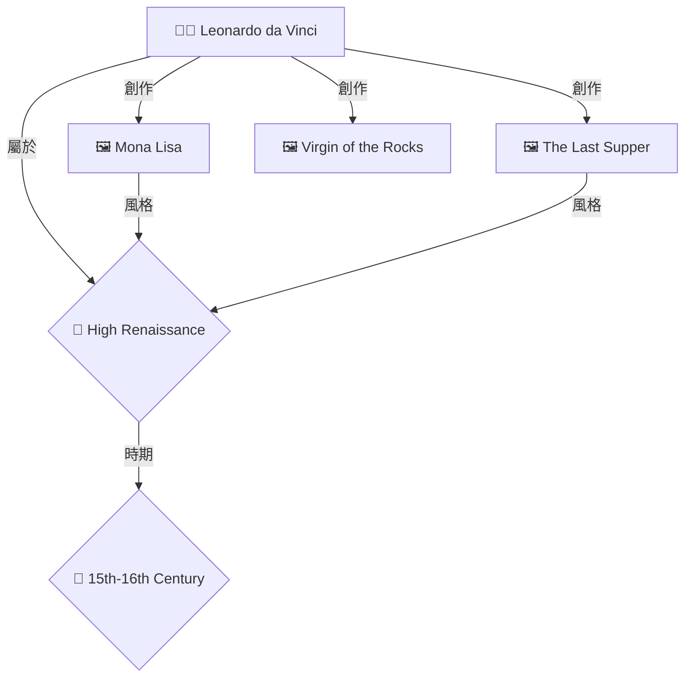

# 🎨 OpenWebUI Pipeline 圖譜視覺化完整指南

## 📋 概述

本指南專門針對使用 **Ollama Modelfile 方式創建 RAG 組合模型** 的架構,通過 OpenWebUI Pipeline 為所有 RAG 模型添加 Neo4j 知識圖譜視覺化功能。

### 🎯 與您的系統完美適配

您的架構:
```bash
創建 RAG 組合模型 (通過 create_full_rag_models.sh)
    ↓
llama31-graph-rag, qwen3-hybrid-rag, deepseek-advanced-rag 等
    ↓
在 OpenWebUI 中直接選擇這些模型
    ↓
Pipeline 自動攔截並添加圖譜視覺化
```

---

## 🚀 快速開始 (3 步驟)

### 步驟 1: 上傳 Pipeline 到 OpenWebUI

1. 打開 OpenWebUI: http://localhost:3000
2. 登入後,進入 **設置 (Settings)**
3. 選擇 **Pipelines** 標籤
4. 點擊 **Add Pipeline**
5. 粘貼 `openwebui_neo4j_graph_pipeline.py` 的內容
6. 點擊 **Save**
7. 啟用 Pipeline (toggle 開關)

### 步驟 2: 配置 Pipeline

在 Pipeline 設置中調整參數:

```yaml
NEO4J_URI: http://localhost:7474
NEO4J_USER: neo4j
NEO4J_PASSWORD: arthistory123  # ⚠️ 修改為您的密碼
ENABLE_GRAPH_VIZ: true
MAX_GRAPH_NODES: 15
MAX_GRAPH_DEPTH: 2
SUPPORTED_RAG_MODELS: graph-rag,hybrid-rag,advanced-rag,agentic-rag
```

**重要**: `SUPPORTED_RAG_MODELS` 定義了哪些 RAG 模型會啟用圖譜視覺化。默認包含:
- `graph-rag` → 所有包含 "graph-rag" 的模型
- `hybrid-rag` → 所有包含 "hybrid-rag" 的模型
- `advanced-rag` → 所有包含 "advanced-rag" 的模型
- `agentic-rag` → 所有包含 "agentic-rag" 的模型

這意味著您通過 `create_full_rag_models.sh` 創建的這些模型都會自動支持圖譜:
- ✅ `llama31-graph-rag`
- ✅ `llama31-hybrid-rag`
- ✅ `llama31-advanced-rag`
- ✅ `llama31-agentic-rag`
- ✅ `qwen3-graph-rag`
- ✅ `qwen3-hybrid-rag`
- ✅ 以及所有其他符合命名模式的模型...

### 步驟 3: 測試

1. 在 OpenWebUI 聊天界面選擇支持圖譜的模型,例如:
   - **llama31-graph-rag** 🕸️
   - **qwen3-8b-hybrid-rag** ⚖️
   - **deepseek-advanced-rag** 🎯

2. 提問:
   ```
   達文西創作了哪些作品?
   ```

3. 您將看到:
   - ✅ Ollama RAG 模型的原始回答
   - ✅ Pipeline 自動添加的知識圖譜
   - ✅ Mermaid 格式的關係圖

---

## 🎨 工作原理

### Pipeline 處理流程

```
1. 用戶提問: "達文西創作了哪些作品?"
        ↓
2. OpenWebUI 發送請求到 Ollama
        ↓
3. Ollama 模型 (如 llama31-graph-rag) 生成回答
        ↓
4. Pipeline 攔截響應:
   - 從用戶問題中提取實體 ["達文西", "Leonardo da Vinci"]
   - 查詢 Neo4j 獲取關係圖譜
   - 生成 Mermaid 圖表
        ↓
5. Pipeline 將圖表添加到原始回答中
        ↓
6. 用戶看到增強後的回答 (原始回答 + 圖譜)
```

### Pipeline vs Function

| 特性 | Pipeline | Function (之前的方案) |
|------|----------|---------------------|
| 適用場景 | Ollama Modelfile 方式 | OpenWebUI Functions 方式 |
| 工作方式 | 攔截模型響應並增強 | 完全替代模型調用 |
| 與現有模型兼容 | ✅ 完美兼容 | ❌ 需要重新設計 |
| 配置方式 | Pipeline 配置界面 | 代碼內配置 |
| 靈活性 | ⭐⭐⭐⭐⭐ | ⭐⭐⭐ |

---

## 🔧 配置詳解

### NEO4J_URI
Neo4j HTTP API 地址

```yaml
# Docker 環境
NEO4J_URI: http://host.docker.internal:7474

# 本地環境
NEO4J_URI: http://localhost:7474

# 遠程服務器
NEO4J_URI: http://your-server:7474
```

### NEO4J_USER / NEO4J_PASSWORD
Neo4j 認證信息

```yaml
NEO4J_USER: neo4j
NEO4J_PASSWORD: your_password_here
```

**安全提示**: 生產環境建議使用環境變量或密鑰管理系統。

### ENABLE_GRAPH_VIZ
啟用/禁用圖譜視覺化

```yaml
ENABLE_GRAPH_VIZ: true   # 啟用
ENABLE_GRAPH_VIZ: false  # 禁用
```

### MAX_GRAPH_NODES
限制圖譜節點數量

```yaml
MAX_GRAPH_NODES: 15  # 推薦值 (10-20)
MAX_GRAPH_NODES: 10  # 更簡潔的圖譜
MAX_GRAPH_NODES: 25  # 更詳細的圖譜
```

### MAX_GRAPH_DEPTH
圖譜查詢深度

```yaml
MAX_GRAPH_DEPTH: 1  # 僅直接關係 (最快)
MAX_GRAPH_DEPTH: 2  # 兩層關係 (推薦)
MAX_GRAPH_DEPTH: 3  # 三層關係 (較慢)
```

### SUPPORTED_RAG_MODELS
支持圖譜的模型關鍵字

```yaml
# 默認配置 (推薦)
SUPPORTED_RAG_MODELS: graph-rag,hybrid-rag,advanced-rag,agentic-rag

# 只為 graph-rag 模型啟用
SUPPORTED_RAG_MODELS: graph-rag

# 為所有模型啟用 (包括 vector-rag, naive-rag 等)
SUPPORTED_RAG_MODELS: rag

# 禁用所有 (留空)
SUPPORTED_RAG_MODELS: ""
```

**匹配規則**: Pipeline 檢查模型 ID 是否包含這些關鍵字(不區分大小寫)。

示例:
- `llama31-graph-rag` → ✅ 匹配 "graph-rag"
- `qwen3-hybrid-rag` → ✅ 匹配 "hybrid-rag"
- `deepseek-vector-rag` → ❌ 不匹配 (vector-rag 不在列表中)
- `gemma3-naive-rag` → ❌ 不匹配

---

## 📊 效果展示

### 輸入
```
用戶: 達文西創作了哪些作品?
模型: llama31-graph-rag
```

### 輸出

```markdown
達文西(Leonardo da Vinci, 1452-1519)是文藝復興時期最偉大的博學者之一。
他創作了許多傳世名作,包括:

1. 《蒙娜麗莎》(Mona Lisa) - 最著名的肖像畫作品
2. 《最後的晚餐》(The Last Supper) - 壁畫傑作
3. 《岩間聖母》(Virgin of the Rocks) - 展現其光影技巧
4. 《抱銀鼠的女子》(Lady with an Ermine) - 肖像畫

---

### 📊 知識圖譜關係圖

> **找到 6 個實體, 10 個關係**

> 💡 **圖例**: 👨‍🎨 藝術家 | 🖼️ 作品 | 🎨 風格 | 📅 時期 | 🏛️ 博物館


```

---

## 🐛 故障排除

### ❌ Pipeline 沒有效果

**檢查清單**:

1. **Pipeline 是否啟用?**
   ```
   OpenWebUI → Settings → Pipelines → 確認開關為 ON
   ```

2. **模型是否匹配?**
   ```
   模型名稱中是否包含 SUPPORTED_RAG_MODELS 中的關鍵字?
   例如: llama31-graph-rag 包含 "graph-rag" ✅
   ```

3. **Neo4j 是否運行?**
   ```bash
   curl http://localhost:7474
   # 應該返回 Neo4j 網頁
   ```

4. **Pipeline 日誌**
   查看 OpenWebUI 後台日誌:
   ```bash
   docker logs open-webui | grep "Neo4j Graph Pipeline"
   ```

### ❌ 圖譜為空

**可能原因**:

1. **數據庫為空**
   ```bash
   docker exec -it art-database-neo4j cypher-shell -u neo4j -p arthistory123
   MATCH (n) RETURN count(n);
   ```
   如果返回 0,需要導入數據。

2. **實體提取失敗**
   Pipeline 無法從問題中識別實體名稱。

   **解決**: 在問題中明確提到實體名稱:
   - ❌ "告訴我關於這位藝術家"
   - ✅ "告訴我關於達文西"

3. **Neo4j 中沒有對應實體**
   提取的實體在數據庫中不存在。

   **檢查**:
   ```cypher
   MATCH (n) WHERE n.name = '達文西' OR n.name = 'Leonardo da Vinci' RETURN n;
   ```

### ❌ 認證失敗

**錯誤**: "Authentication failed"

**解決**:
1. 確認 Pipeline 配置中的密碼正確
2. 測試連接:
   ```bash
   curl -u neo4j:arthistory123 http://localhost:7474/db/neo4j/tx/commit
   ```

### ❌ Mermaid 圖表不渲染

**可能原因**:

1. **OpenWebUI 版本過舊**
   - 更新到最新版本: `docker-compose pull open-webui`

2. **Mermaid 語法錯誤**
   - 查看 Pipeline 日誌確認生成的語法

---

## 🎯 進階使用

### 1. 自定義實體提取

修改 `extract_entities_from_text` 方法以支持更多實體類型:

```python
def extract_entities_from_text(self, text: str) -> List[str]:
    entities = set()

    # 添加博物館名稱
    museum_patterns = [
        r'(羅浮宮|烏菲茲美術館|大都會博物館)',
        r'(Louvre|Uffizi|Metropolitan Museum)',
    ]

    for pattern in museum_patterns:
        matches = re.findall(pattern, text, re.IGNORECASE)
        entities.update(matches)

    # ... 其他提取邏輯
    return list(entities)
```

### 2. 自定義圖表樣式

修改 `format_mermaid_graph` 方法:

```python
# 更改圖表方向
mermaid_lines = ["```mermaid", "graph LR"]  # 橫向

# 添加新節點類型
elif node_label == "Technique":
    style = f"{node_id}[🖌️ {node_name}]"

# 添加新關係類型
rel_translations = {
    # ... 現有翻譯
    "USES_TECHNIQUE": "使用技法",
    "INSPIRED_BY": "啟發自",
}
```

### 3. 條件性啟用圖譜

根據問題內容決定是否顯示圖譜:

```python
def should_show_graph(self, user_message: str) -> bool:
    """檢查是否應該顯示圖譜"""
    # 包含這些關鍵詞時顯示圖譜
    keywords = ["關係", "影響", "作品", "風格", "創作"]
    return any(kw in user_message for kw in keywords)
```

### 4. 多語言支持

```python
# 在 format_mermaid_graph 中
if language == "en":
    legend = f"### 📊 Knowledge Graph\n> Found {entity_count} entities..."
elif language == "zh":
    legend = f"### 📊 知識圖譜\n> 找到 {entity_count} 個實體..."
```

---

## 🔄 與您的 RAG 模型集成

### 您創建的 35 個模型

通過 `create_full_rag_models.sh` 創建的模型:

| 基礎模型 | RAG 策略 | 圖譜支持 |
|---------|---------|---------|
| llama3.1:8b | graph-rag | ✅ 是 |
| llama3.1:8b | hybrid-rag | ✅ 是 |
| llama3.1:8b | advanced-rag | ✅ 是 |
| llama3.1:8b | agentic-rag | ✅ 是 |
| llama3.1:8b | self-rag | ❌ 否 (可配置) |
| llama3.1:8b | vector-rag | ❌ 否 (可配置) |
| llama3.1:8b | naive-rag | ❌ 否 (可配置) |
| ... | ... | ... |

**啟用更多模型**:

修改 Pipeline 配置:
```yaml
# 為所有 RAG 模型啟用
SUPPORTED_RAG_MODELS: rag

# 或添加特定類型
SUPPORTED_RAG_MODELS: graph-rag,hybrid-rag,advanced-rag,agentic-rag,self-rag
```

---

## 📈 性能優化

### 1. 減少節點數量

```yaml
MAX_GRAPH_NODES: 10  # 從 15 減少到 10
```

### 2. 降低查詢深度

```yaml
MAX_GRAPH_DEPTH: 1  # 從 2 降低到 1
```

### 3. 限制支持的模型

只為最需要的模型啟用圖譜:

```yaml
SUPPORTED_RAG_MODELS: graph-rag  # 只有 graph-rag 模型
```

### 4. 添加 Neo4j 索引

```bash
docker exec -it art-database-neo4j cypher-shell -u neo4j -p arthistory123

# 在 cypher-shell 中執行
CREATE INDEX artist_name IF NOT EXISTS FOR (a:Artist) ON (a.name);
CREATE INDEX artwork_title IF NOT EXISTS FOR (a:Artwork) ON (a.title);
```

---

## ✅ 驗證清單

部署前確認:

- [ ] OpenWebUI Pipelines 功能可用
- [ ] Pipeline 已上傳並啟用
- [ ] Neo4j 服務運行正常
- [ ] Neo4j 連接配置正確
- [ ] 數據庫包含足夠數據
- [ ] 至少測試了一個支持的 RAG 模型
- [ ] 圖譜能正常顯示

---

## 🎉 總結

使用 OpenWebUI Pipeline 的優勢:

✅ **無縫集成** - 與您現有的 35 個 RAG 組合模型完美配合
✅ **零修改** - 不需要修改 Modelfile 或重新創建模型
✅ **靈活配置** - 通過 UI 配置,無需修改代碼
✅ **選擇性啟用** - 只為需要的 RAG 策略啟用圖譜
✅ **自動增強** - 自動為支持的模型添加圖譜,用戶體驗流暢

---

**版本**: v1.0.0
**更新日期**: 2025-11-27
**作者**: Art History Database Team

**🚀 開始使用您的知識圖譜增強型 RAG 系統吧!**
