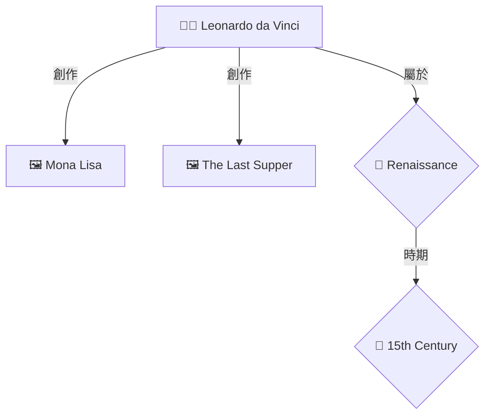

# OpenWebUI Neo4j 圖譜視覺化配置指南

## 📋 概述

本指南說明如何在 OpenWebUI 中實現 Neo4j 知識圖譜的視覺化顯示,讓用戶在問答時可以看到藝術史實體之間的關係。

## ✨ 功能特點

- 🕸️ **自動圖譜提取**: 從 RAG 檢索結果中自動提取相關實體
- 📊 **Mermaid 視覺化**: 使用 Mermaid 圖表語法渲染關係圖
- 🎨 **智能分類**: 不同類型實體(藝術家/作品/風格/時期)使用不同圖標
- 🔗 **關係標註**: 清晰顯示實體間的關係類型(創作/影響/屬於等)
- ⚡ **性能優化**: 限制節點和邊數量,保持圖表可讀性

## 🚀 快速開始

### 1. 替換 OpenWebUI 函數

將新的函數文件 `enhanced_openwebui_rag_function_v6_with_graph_viz.py` 上傳到 OpenWebUI:

1. 登入 OpenWebUI 管理界面
2. 進入 **Functions** 設置
3. 上傳或粘貼新函數代碼
4. 保存並啟用

### 2. 確保服務運行

確保以下服務正在運行:

```bash
# 檢查 Neo4j
curl http://localhost:7474

# 檢查 RAG 服務器(根據您的配置)
curl http://localhost:8008/health  # 標準服務器
curl http://localhost:8009/health  # 增強服務器
curl http://localhost:8010/health  # 多資料庫服務器
```

### 3. 測試圖譜顯示

在 OpenWebUI 中選擇支持圖譜的模型組合:

- **🚀 Llama 3.1 70B + Enhanced RAG** (推薦)
- **🕸️ Qwen3 30B + Graph RAG**
- **⚖️ DeepSeek-R1 32B + Hybrid RAG**

然後詢問關於藝術家或作品的問題:

```
達文西創作了哪些作品?
米開朗基羅和拉斐爾有什麼關係?
文藝復興時期的重要藝術家有哪些?
```

## 📊 圖譜視覺化示例

當您提問後,系統會返回:

1. **文字回答**: 基於 LLM 生成的專業回答
2. **知識圖譜**: Mermaid 格式的關係圖
3. **參考來源**: 檢索到的具體文檔
4. **系統信息**: 使用的模型和策略

### 示例輸出

```markdown
## 📝 回答

達文西(Leonardo da Vinci, 1452-1519)是文藝復興時期最偉大的藝術家之一...

### 📊 知識圖譜關係圖 (5 個實體, 8 個關係)

> 💡 **圖例說明:**
> - 👨‍🎨 方框 = 藝術家
> - 🖼️ 方框 = 藝術品
> - 🎨 菱形 = 藝術風格
> - 📅 菱形 = 時代/時期



---

### 📚 參考來源
...
```

## 🔧 配置選項

### Neo4j 連接設置

在函數代碼中調整(約第28-32行):

```python
if os.getenv('DOCKER_ENV') == 'true':
    self.neo4j_url = "http://host.docker.internal:7474"
else:
    self.neo4j_url = "http://localhost:7474"

self.neo4j_auth = ("neo4j", "arthistory123")  # ⚠️ 修改為您的密碼
```

### 圖譜參數調整

在 `query_neo4j_graph` 方法中:

```python
def query_neo4j_graph(self, entity_names: List[str], max_depth: int = 2):
    # max_depth: 關係深度 (1-3 推薦, 避免過大)
    pass
```

在 `format_graph_visualization` 方法中:

```python
for i, node in enumerate(nodes[:20]):  # 最多 20 個節點
for edge in edges[:30]:  # 最多 30 條邊
```

### 啟用/禁用圖譜

在 `rag_strategies` 配置中:

```python
self.rag_strategies = {
    "enhanced_rag": {
        # ...
        "show_graph": True   # True=顯示圖譜, False=不顯示
    }
}
```

## 🎨 自定義圖表樣式

### 節點樣式

修改 `format_graph_visualization` 方法中的節點樣式:

```python
if node_label == "Artist":
    style = f"{node_id}[👨‍🎨 {node_name}]"  # 方框
elif node_label == "Artwork":
    style = f"{node_id}[🖼️ {node_name}]"   # 方框
elif node_label == "Style":
    style = f"{node_id}{{{node_name}}}"   # 菱形 {{}}
elif node_label == "Period":
    style = f"{node_id}(({node_name}))"   # 圓形 (())
```

### 關係類型翻譯

添加更多關係類型:

```python
rel_translations = {
    "CREATED": "創作",
    "INFLUENCED": "影響",
    "BELONGS_TO": "屬於",
    "EXHIBITED_AT": "展出於",
    "STUDIED_UNDER": "師從",
    "CONTEMPORARY_OF": "同時代",
    # 添加您的自定義關係
    "INSPIRED_BY": "啟發自",
    "COLLECTED_BY": "收藏於"
}
```

## 🐛 常見問題

### 1. 圖譜不顯示

**原因**: Neo4j 服務未運行或連接失敗

**解決**:
```bash
# 檢查 Neo4j 狀態
docker ps | grep neo4j

# 重啟 Neo4j
docker restart art-database-neo4j

# 測試連接
curl -u neo4j:arthistory123 http://localhost:7474/db/neo4j/tx/commit
```

### 2. 圖譜為空

**原因**:
- 數據庫中沒有相關實體
- 實體提取失敗

**解決**:
```bash
# 檢查 Neo4j 數據
docker exec -it art-database-neo4j cypher-shell -u neo4j -p arthistory123

# 在 cypher-shell 中執行
MATCH (n) RETURN count(n);  # 檢查節點總數
MATCH ()-[r]->() RETURN count(r);  # 檢查關係總數
MATCH (a:Artist) RETURN a.name LIMIT 10;  # 查看藝術家
```

### 3. Mermaid 圖表渲染錯誤

**原因**: OpenWebUI 版本不支持 Mermaid

**解決**:
- 更新 OpenWebUI 到最新版本
- 或使用文本格式輸出圖譜關係

### 4. 性能問題 (查詢太慢)

**解決**:
```python
# 減少節點數量
for i, node in enumerate(nodes[:10]):  # 從 20 改為 10

# 減少關係深度
graph_data = tools.query_neo4j_graph(entities, max_depth=1)  # 從 2 改為 1
```

## 📈 進階功能

### 1. 互動式圖譜 (需要前端支持)

如果您想要可縮放、可拖動的互動式圖譜,可以考慮:

- **D3.js**: 強大的圖形庫
- **Cytoscape.js**: 專門的圖網絡庫
- **vis.js**: 簡單易用的網絡可視化

這需要修改 OpenWebUI 前端,或使用 iframe 嵌入外部圖表。

### 2. 圖譜分析統計

添加圖譜統計信息:

```python
# 在 format_graph_visualization 中添加
stats = f"""
**圖譜統計**:
- 節點數量: {len(nodes)}
- 關係數量: {len(edges)}
- 藝術家: {sum(1 for n in nodes if n['label'] == 'Artist')}
- 作品: {sum(1 for n in nodes if n['label'] == 'Artwork')}
"""
```

### 3. 導出圖譜數據

允許用戶下載圖譜數據:

```python
# 返回 JSON 格式的圖譜數據
graph_json = json.dumps(graph_data, ensure_ascii=False, indent=2)
answer_parts.append(f"""
<details>
<summary>📥 下載圖譜數據 (JSON)</summary>

```json
{graph_json}
```
</details>
""")
```

## 🔐 安全建議

1. **不要在代碼中硬編碼密碼**:
   ```python
   import os
   self.neo4j_auth = (
       os.getenv("NEO4J_USER", "neo4j"),
       os.getenv("NEO4J_PASSWORD", "arthistory123")
   )
   ```

2. **限制查詢複雜度**:
   - 限制實體數量 (目前為 10)
   - 限制關係深度 (目前為 2)
   - 設置查詢超時 (目前為 10 秒)

3. **驗證用戶輸入**: 避免 Cypher 注入攻擊

## 📚 參考資源

- [Mermaid 文檔](https://mermaid.js.org/)
- [Neo4j Cypher 手冊](https://neo4j.com/docs/cypher-manual/)
- [OpenWebUI Functions 文檔](https://docs.openwebui.com/)

## 🆘 支持

如有問題,請檢查:

1. Neo4j 日誌: `docker logs art-database-neo4j`
2. RAG 服務器日誌
3. OpenWebUI 函數執行日誌

---

**版本**: v6.0.0
**更新日期**: 2025-11-27
**作者**: Art History Database Team
