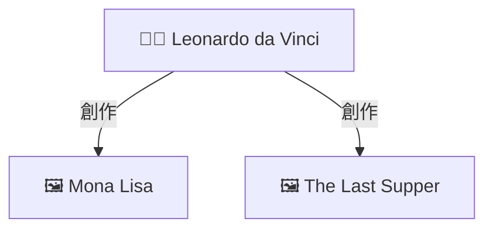

# 🚀 Pipeline 圖譜視覺化 - 超快速開始

> 為您通過 `create_full_rag_models.sh` 創建的 35 個 RAG 模型添加知識圖譜!

---

## ⚡ 3 分鐘完成設置

### 1️⃣ 測試系統 (1 分鐘)

```bash
cd art-history-database
python test_pipeline_graph.py
```

**看到這些就 OK**:
- ✅ Neo4j 連接成功
- ✅ 找到圖譜數據
- ✅ 生成 Mermaid 圖表

---

### 2️⃣ 上傳 Pipeline (1 分鐘)

1. 打開 OpenWebUI: http://localhost:3000
2. 進入 **Settings** → **Pipelines**
3. 點擊 **Add Pipeline**
4. 粘貼 `openwebui_neo4j_graph_pipeline.py` 的內容
5. **Save** 並啟用 (toggle ON)

---

### 3️⃣ 配置 Pipeline (1 分鐘)

在 Pipeline 設置中,只需修改密碼:

```yaml
NEO4J_PASSWORD: arthistory123  # ⚠️ 改為您的實際密碼
```

其他保持默認即可!

---

### 4️⃣ 開始使用! (立即)

1. **選擇支持的 RAG 模型**:
   - `llama31-graph-rag` 🕸️
   - `qwen3-hybrid-rag` ⚖️
   - `deepseek-advanced-rag` 🎯

2. **提問**:
   ```
   達文西創作了哪些作品?
   ```

3. **享受圖譜!** 🎉

---

## 📊 預期效果

```markdown
達文西創作了《蒙娜麗莎》、《最後的晚餐》等傳世名作...

---

### 📊 知識圖譜關係圖


```

---

## 🎯 支持的模型

默認配置下,這些模型會顯示圖譜:

### ✅ 支持 (自動啟用)
- ✅ 所有 `*-graph-rag` 模型
- ✅ 所有 `*-hybrid-rag` 模型
- ✅ 所有 `*-advanced-rag` 模型
- ✅ 所有 `*-agentic-rag` 模型

### ❌ 不支持 (默認)
- ❌ `*-vector-rag` 模型
- ❌ `*-self-rag` 模型
- ❌ `*-naive-rag` 模型

**想啟用所有模型?**

修改 Pipeline 配置:
```yaml
SUPPORTED_RAG_MODELS: rag  # 所有包含 "rag" 的模型
```

---

## 🔧 常見問題

### ❌ 沒有圖譜?

**檢查 3 件事**:

1. **Pipeline 啟用了嗎?**
   Settings → Pipelines → 開關 ON

2. **模型支持嗎?**
   模型名稱包含 `graph-rag`, `hybrid-rag`, `advanced-rag` 或 `agentic-rag`

3. **Neo4j 運行嗎?**
   ```bash
   docker ps | grep neo4j
   ```

### ❌ 圖譜為空?

**數據庫可能為空**

```bash
# 檢查數據
python test_pipeline_graph.py
```

---

## 📚 詳細文檔

- **完整指南**: `OpenWebUI_Pipeline_圖譜視覺化指南.md`
- **測試腳本**: `test_pipeline_graph.py`

---

## 🎨 核心優勢

✅ **零修改** - 不需要修改您的 35 個 RAG 模型
✅ **自動增強** - Pipeline 自動為支持的模型添加圖譜
✅ **靈活配置** - 通過 UI 配置,無需改代碼
✅ **即插即用** - 上傳即可使用

---

## 📝 文件清單

### 核心文件
- `openwebui_neo4j_graph_pipeline.py` ⭐ - Pipeline 主文件

### 文檔
- `OpenWebUI_Pipeline_圖譜視覺化指南.md` - 完整指南
- `Pipeline_圖譜視覺化_快速開始.md` - 本文件

### 工具
- `test_pipeline_graph.py` - 測試腳本

---

## ✅ 驗證清單

- [ ] 測試腳本通過
- [ ] Pipeline 已上傳
- [ ] Pipeline 已啟用
- [ ] 密碼配置正確
- [ ] 選擇了支持的模型
- [ ] 看到圖譜了!

---

**🎉 完成! 開始享受您的知識圖譜增強型 RAG 系統吧!**

**版本**: v1.0.0 | **日期**: 2025-11-27
