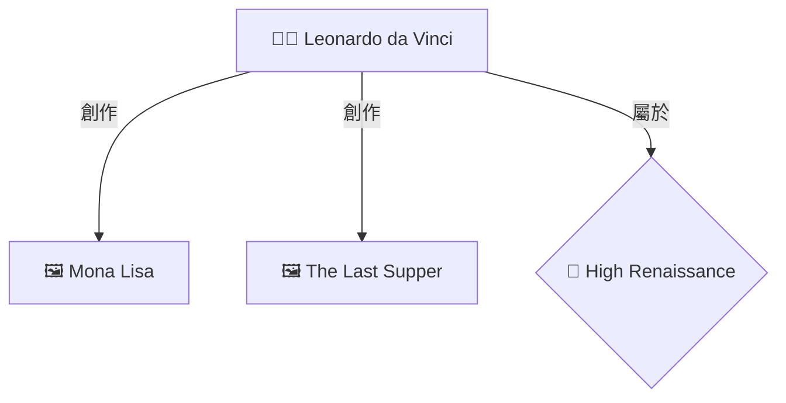

# 📊 OpenWebUI Neo4j 圖譜視覺化功能

## 🎯 功能說明

本功能讓您在使用 OpenWebUI 進行藝術史知識問答時,可以自動顯示 Neo4j 知識圖譜中的關係節點,直觀地展示藝術家、作品、風格和時期之間的關聯。

## 🌟 主要特色

- 🕸️ **自動圖譜生成**: 從問答中自動提取實體並生成關係圖
- 📊 **Mermaid 視覺化**: 使用現代化的圖表語法,在聊天界面中直接渲染
- 🎨 **智能分類**: 不同類型實體使用不同圖標(藝術家👨‍🎨、作品🖼️、風格🎨、時期📅)
- 🔗 **關係標註**: 清晰顯示"創作"、"影響"、"屬於"等關係類型
- ⚡ **性能優化**: 自動限制圖譜大小,保持可讀性

## 📦 已創建的文件

### 核心文件

1. **`enhanced_openwebui_rag_function_v6_with_graph_viz.py`** ⭐
   - OpenWebUI 函數主文件
   - 直接上傳到 OpenWebUI 使用

### 文檔與指南

2. **`OpenWebUI_圖譜視覺化配置指南.md`**
   - 詳細的配置和自定義說明
   - 故障排除指南

3. **`啟動圖譜視覺化功能.md`**
   - 快速開始步驟
   - 測試問題示例
   - 預期輸出展示

4. **`OpenWebUI_Neo4j_圖譜視覺化_完成報告.md`**
   - 項目總結報告
   - 技術架構說明
   - 未來擴展計劃

### 工具與演示

5. **`test_graph_visualization.py`**
   - 自動化測試腳本
   - 可用於診斷問題

6. **`graph_visualization_demo.html`**
   - 互動式演示頁面
   - 包含多個圖譜示例

7. **`start_graph_viz_demo.sh`**
   - 快速啟動腳本
   - 自動檢查和測試

## 🚀 快速開始 (3 步驟)

### 步驟 1: 測試系統

```bash
# 運行測試腳本
python test_graph_visualization.py
```

應該看到:
```
✅ Neo4j 連接成功
✅ 查詢成功: 節點數量: 5, 關係數量: 8
```

### 步驟 2: 上傳到 OpenWebUI

1. 訪問 OpenWebUI: http://localhost:3000
2. 點擊右上角頭像 → **Admin Panel**
3. 選擇 **Functions** 標籤
4. 點擊 **+ Create New Function**
5. 複製並粘貼 `enhanced_openwebui_rag_function_v6_with_graph_viz.py` 的內容
6. 點擊 **Save** 並**啟用**函數

### 步驟 3: 測試問答

選擇支持圖譜的模型:
- **🚀 Llama 3.1 70B + Enhanced RAG** (推薦)
- **🕸️ Qwen3 30B + Graph RAG**
- **⚖️ DeepSeek-R1 32B + Hybrid RAG**

測試問題:
```
達文西創作了哪些作品?
米開朗基羅和拉斐爾有什麼關係?
文藝復興時期的重要藝術家有哪些?
```

## 📊 效果展示

您會在回答中看到類似這樣的圖譜:



## 🔧 配置選項

### 調整圖譜大小

在函數文件中修改(約第383行):

```python
# 節點數量限制
for i, node in enumerate(nodes[:20]):  # 改為 10 或 15

# 關係數量限制
for edge in edges[:30]:  # 改為 15 或 20
```

### 修改關係深度

在函數文件中修改(約第583行):

```python
# 關係深度: 1 = 僅直接關係, 2 = 兩層關係
graph_data = tools.query_neo4j_graph(entities, max_depth=2)  # 改為 1
```

### 啟用/禁用圖譜

在函數文件中修改(約第63行):

```python
self.rag_strategies = {
    "enhanced_rag": {
        # ...
        "show_graph": True   # 改為 False 禁用圖譜
    }
}
```

## 🐛 常見問題

### ❌ 圖譜不顯示

**解決方案**:
1. 檢查 Neo4j 是否運行: `docker ps | grep neo4j`
2. 檢查數據庫是否有數據: `python test_graph_visualization.py`
3. 查看 OpenWebUI 函數日誌

### ❌ Neo4j 連接失敗

**解決方案**:
```bash
# 啟動 Neo4j
docker-compose up -d neo4j

# 檢查日誌
docker logs art-database-neo4j

# 測試連接
curl http://localhost:7474
```

### ❌ 數據庫為空

**解決方案**:
```bash
# 導入數據 (根據您的實際腳本)
python import_to_neo4j.py
# 或
python restructure_neo4j_12categories.py
```

## 📚 詳細文檔

- **配置與自定義**: 參考 `OpenWebUI_圖譜視覺化配置指南.md`
- **快速開始**: 參考 `啟動圖譜視覺化功能.md`
- **項目總結**: 參考 `OpenWebUI_Neo4j_圖譜視覺化_完成報告.md`

## 🎨 查看演示

在瀏覽器中打開 `graph_visualization_demo.html` 查看互動演示:

```bash
# Windows
start graph_visualization_demo.html

# Linux
xdg-open graph_visualization_demo.html

# macOS
open graph_visualization_demo.html
```

## 💡 使用建議

### 最佳實踐

1. **選擇合適的模型組合**: Enhanced RAG 或 Graph RAG 策略可以獲得最好的圖譜效果
2. **問具體的問題**: 如"達文西創作了哪些作品"比"告訴我關於達文西"能生成更好的圖譜
3. **關注實體名稱**: 問題中包含明確的藝術家或作品名稱能提高圖譜質量

### 性能優化

- 如果圖譜生成較慢,可以減少節點數量限制
- 如果圖譜過於複雜,可以降低關係深度
- 建議在 Neo4j 中添加索引以提高查詢速度

## ✅ 驗證清單

部署前確認:

- [ ] Neo4j 服務正在運行
- [ ] 測試腳本通過
- [ ] 演示頁面可以正常顯示
- [ ] OpenWebUI 函數已上傳並啟用
- [ ] 至少測試了一個問題並看到圖譜

## 🎯 下一步

1. ✅ 測試基本功能
2. ⚙️ 根據需要調整配置
3. 📊 查看演示和文檔
4. 🚀 開始使用!

## 📞 支持

如有問題:
1. 運行 `test_graph_visualization.py` 診斷
2. 查看相關文檔
3. 檢查服務日誌

---

**版本**: v6.0.0
**更新**: 2025-11-27
**作者**: Art History Database Team

**🎉 祝使用愉快!**
