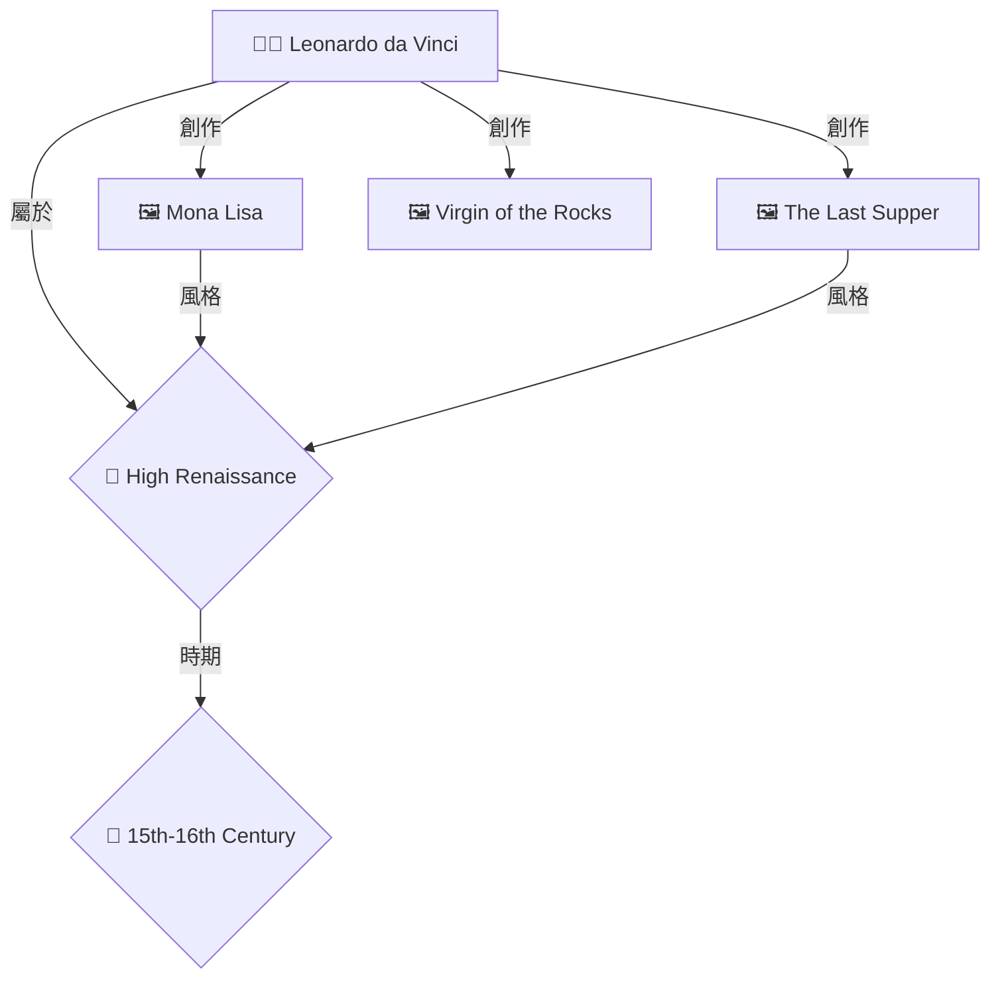

# 🚀 啟動 OpenWebUI 圖譜視覺化功能

## 快速步驟

### 1️⃣ 測試系統狀態

```bash
# 運行測試腳本
python test_graph_visualization.py
```

**預期輸出**:
```
✅ Neo4j 連接成功
✅ 查詢成功:
   - 節點數量: 5
   - 關係數量: 8
📊 Mermaid 圖表:
...
```

如果出現錯誤,請參考下面的故障排除。

---

### 2️⃣ 上傳函數到 OpenWebUI

#### 方法 A: Web 界面上傳

1. 打開 OpenWebUI: `http://localhost:3000` (或您的 OpenWebUI 地址)
2. 登入後,點擊右上角頭像 → **Admin Panel**
3. 進入 **Functions** 標籤
4. 點擊 **+ Create New Function**
5. 複製 `enhanced_openwebui_rag_function_v6_with_graph_viz.py` 的內容
6. 粘貼到編輯器
7. 點擊 **Save**
8. 切換開關以**啟用**此函數

#### 方法 B: 使用 OpenWebUI API (如果已配置)

```bash
# 設置環境變量
export OPENWEBUI_URL="http://localhost:3000"
export OPENWEBUI_API_KEY="your-api-key"

# 上傳函數 (需要 curl 或 httpie)
curl -X POST "$OPENWEBUI_URL/api/v1/functions" \
  -H "Authorization: Bearer $OPENWEBUI_API_KEY" \
  -H "Content-Type: application/json" \
  -d @enhanced_openwebui_rag_function_v6_with_graph_viz.py
```

---

### 3️⃣ 配置模型組合

在 OpenWebUI 聊天界面:

1. 點擊模型選擇器
2. 選擇支持圖譜的組合:
   - **🚀 Llama 3.1 70B + Enhanced RAG** ⭐ 推薦
   - **🕸️ Qwen3 30B + Graph RAG**
   - **⚖️ DeepSeek-R1 32B + Hybrid RAG**

---

### 4️⃣ 測試問答

在聊天框中輸入測試問題:

#### 測試問題 1: 藝術家作品查詢
```
達文西創作了哪些著名作品?
```

**預期回答**:
- ✅ 文字回答: 介紹達文西的主要作品
- ✅ 知識圖譜: 顯示達文西、作品、風格的關係圖
- ✅ 參考來源: 列出檢索到的文檔

#### 測試問題 2: 藝術家關係查詢
```
米開朗基羅和拉斐爾有什麼關係?
```

**預期回答**:
- ✅ 關係分析
- ✅ 圖譜顯示兩位藝術家及其共同的時期、風格

#### 測試問題 3: 風格時期查詢
```
文藝復興時期有哪些代表性藝術家?
```

**預期回答**:
- ✅ 藝術家列表
- ✅ 圖譜顯示文藝復興時期與多位藝術家的關係

---

## 📊 示例輸出

當圖譜功能正常工作時,您會看到類似下面的輸出:

```markdown
## 📝 回答

達文西(Leonardo da Vinci, 1452-1519)是意大利文藝復興時期的博學者...
他的著名作品包括:
- 《蒙娜麗莎》(Mona Lisa)
- 《最後的晚餐》(The Last Supper)
- 《岩間聖母》(Virgin of the Rocks)

### 📊 知識圖譜關係圖 (6 個實體, 10 個關係)

> 💡 **圖例說明:**
> - 👨‍🎨 方框 = 藝術家
> - 🖼️ 方框 = 藝術品
> - 🎨 菱形 = 藝術風格
> - 📅 菱形 = 時代/時期



---

### 📚 參考來源

**1.** [vector@chromadb] (相關度: 0.892)
> Leonardo da Vinci was an Italian polymath of the Renaissance...

**2.** [graph@neo4j] (相關度: 0.845)
> Artist: Leonardo da Vinci, Born: 1452, Died: 1519...

---

<details>
<summary>🔧 系統信息</summary>

- **LLM模型**: llama3.1:70b
- **RAG策略**: enhanced_rag
- **數據源**: neo4j+chromadb
- **服務器**: http://localhost:8010
- **檢索項目**: 5

</details>
```

---

## 🔧 故障排除

### ❌ Neo4j 連接失敗

**症狀**: 測試腳本顯示 "Neo4j 連接失敗"

**解決方案**:
```bash
# 檢查 Neo4j 是否運行
docker ps | grep neo4j

# 如果沒有運行,啟動它
docker-compose up -d neo4j

# 檢查日誌
docker logs art-database-neo4j

# 測試連接
curl http://localhost:7474
```

---

### ❌ 圖譜不顯示

**症狀**: 回答中沒有 Mermaid 圖表

**可能原因及解決方案**:

#### 1. 數據庫為空
```bash
# 檢查數據
docker exec -it art-database-neo4j cypher-shell -u neo4j -p arthistory123

# 在 cypher-shell 中執行
MATCH (n) RETURN count(n);

# 如果返回 0,需要導入數據
python import_to_neo4j.py
```

#### 2. 實體提取失敗
查看 OpenWebUI 函數日誌,確認是否提取到實體名稱。

如果沒有,可以手動指定實體:
```python
# 在函數中修改
entities = ["Leonardo da Vinci", "Mona Lisa"]  # 硬編碼測試
```

#### 3. OpenWebUI 不支持 Mermaid
檢查 OpenWebUI 版本:
```bash
docker exec -it open-webui env | grep VERSION
```

如果版本過舊,更新 OpenWebUI:
```bash
docker-compose pull open-webui
docker-compose up -d open-webui
```

---

### ❌ RAG 服務器不可用

**症狀**: "所有RAG服務器均不可用"

**解決方案**:
```bash
# 檢查哪些服務在運行
curl http://localhost:8008/health  # 標準服務器
curl http://localhost:8009/health  # 增強服務器
curl http://localhost:8010/health  # 多資料庫服務器

# 啟動需要的服務器
# 例如,多資料庫服務器:
node multi-database-rag-server.js &

# 或者使用 Python 版本
python enhanced_rag_strategy_server.py &
```

---

### ❌ 權限錯誤

**症狀**: "Authentication failed"

**解決方案**:

修改函數中的 Neo4j 認證信息:
```python
# 在 enhanced_openwebui_rag_function_v6_with_graph_viz.py 中
self.neo4j_auth = ("neo4j", "YOUR_ACTUAL_PASSWORD")
```

或通過環境變量設置:
```bash
export NEO4J_PASSWORD="your_password"
```

---

## 🎨 自定義選項

### 調整圖譜大小

**減少節點數量** (如果圖譜太大):
```python
# 在函數中找到這一行 (約第383行)
for i, node in enumerate(nodes[:10]):  # 從 20 改為 10
```

**減少關係深度** (查詢更快):
```python
# 在函數中找到這一行 (約第583行)
graph_data = tools.query_neo4j_graph(entities, max_depth=1)  # 從 2 改為 1
```

### 更改圖表樣式

**使用不同的圖表類型**:
```python
# 修改 format_graph_visualization 方法
mermaid_lines = ["```mermaid", "flowchart LR"]  # 橫向流程圖
# 或
mermaid_lines = ["```mermaid", "graph LR"]     # 橫向圖
```

### 禁用圖譜 (只返回文字)

```python
# 在 rag_strategies 配置中
"enhanced_rag": {
    # ...
    "show_graph": False   # 設為 False
}
```

---

## 📈 性能建議

### 優化 Neo4j 查詢

1. **添加索引**:
```cypher
CREATE INDEX artist_name IF NOT EXISTS FOR (a:Artist) ON (a.name);
CREATE INDEX artwork_title IF NOT EXISTS FOR (a:Artwork) ON (a.title);
```

2. **限制查詢深度**:
```python
# 深度1: 只查詢直接關係 (最快)
# 深度2: 查詢兩層關係 (平衡)
# 深度3: 查詢三層關係 (較慢,不推薦)
```

3. **使用緩存**:
未來可以添加圖譜查詢緩存,避免重複查詢。

---

## 🎯 進階功能

### 1. 添加圖譜統計

在回答中顯示更多統計信息:
```python
stats = f"""
**圖譜分析**:
- 中心節點: {most_connected_node}
- 最多關係類型: {most_common_relationship}
- 圖譜密度: {density}
"""
```

### 2. 支持更多實體類型

添加更多節點樣式:
```python
elif node_label == "Museum":
    style = f"{node_id}[🏛️ {node_name}]"
elif node_label == "Technique":
    style = f"{node_id}[🖌️ {node_name}]"
```

### 3. 互動式圖譜

如果 OpenWebUI 支持自定義 UI,可以使用 D3.js 或 Cytoscape.js 創建可交互的圖譜。

---

## ✅ 驗證清單

在部署到生產環境前,確認:

- [ ] Neo4j 服務運行正常
- [ ] 數據庫包含足夠的數據
- [ ] 測試腳本全部通過
- [ ] 在 OpenWebUI 中成功顯示圖譜
- [ ] 測試了多個問題類型
- [ ] 性能可接受 (響應時間 < 10秒)
- [ ] 圖譜可讀性良好 (節點不超過20個)
- [ ] 錯誤處理正常

---

## 📞 需要幫助?

如果遇到問題:

1. 查看測試腳本輸出
2. 檢查 Neo4j 日誌: `docker logs art-database-neo4j`
3. 檢查 OpenWebUI 函數執行日誌
4. 參考配置指南: `OpenWebUI_圖譜視覺化配置指南.md`

---

**祝您使用愉快!** 🎉

有任何問題歡迎反饋。
