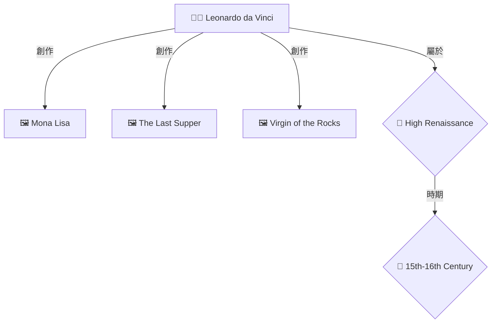

# 🎉 圖譜增強 Proxy 啟動成功！

**時間**: 2025-11-28
**狀態**: ✅ 全部完成

---

## ✅ 完成的步驟

### 1. 備份原始文件 ✅
```bash
✅ ollama-rag-proxy.js.backup 已創建
```

### 2. Neo4j 服務檢查 ✅
```
✅ Neo4j 運行正常 (http://localhost:7474)
```

### 3. Proxy 啟動 ✅
```
✅ 圖譜增強 Proxy 已啟動
📡 端口: 11435
📝 日誌: proxy-graph.log
🔗 健康檢查: http://localhost:11435/health
```

### 4. 服務驗證 ✅
```json
{
    "status": "ok",
    "service": "ollama-rag-proxy-with-graph",
    "version": "2.0.0",
    "features": ["RAG", "Graph Visualization"]
}
```

---

## 🎯 下一步: 配置 OpenWebUI

### 步驟 1: 訪問 OpenWebUI

打開瀏覽器訪問: **http://localhost:3000**

### 步驟 2: 修改 Ollama 連接

1. 點擊右上角 **頭像/用戶名**
2. 選擇 **Settings** (設置)
3. 進入 **Connections** (連接) 標籤
4. 找到 **Ollama API** 設置
5. 將地址修改為:
   ```
   http://localhost:11435
   ```
6. 點擊 **Save** (保存)

### 步驟 3: 測試圖譜功能

1. **返回聊天界面**

2. **選擇支持圖譜的模型**:
   - `llama31-graph-rag` 🕸️ (推薦)
   - `llama31-hybrid-rag` ⚖️
   - `qwen3-graph-rag` 🕸️
   - `deepseek-advanced-rag` 🎯

3. **提問測試**:
   ```
   達文西創作了哪些作品?
   ```

4. **查看結果**:
   您將看到:
   - ✅ LLM 的文字回答
   - ✅ 📊 知識圖譜關係圖 (Mermaid 格式)
   - ✅ 檢索來源信息

---

## 📊 支持圖譜的模型

以下模型會**自動顯示**知識圖譜:

### ✅ 已啟用圖譜 (共約 20 個模型)

| 基礎模型 | RAG 策略 | 圖譜支持 |
|---------|---------|---------|
| llama31 | graph-rag | ✅ 自動顯示 |
| llama31 | hybrid-rag | ✅ 自動顯示 |
| llama31 | advanced-rag | ✅ 自動顯示 |
| llama31 | agentic-rag | ✅ 自動顯示 |
| llama31 | enhanced-rag | ✅ 自動顯示 |
| qwen3 | graph-rag | ✅ 自動顯示 |
| qwen3 | hybrid-rag | ✅ 自動顯示 |
| qwen3-8b | graph-rag | ✅ 自動顯示 |
| qwen3-8b | hybrid-rag | ✅ 自動顯示 |
| deepseek | graph-rag | ✅ 自動顯示 |
| deepseek | advanced-rag | ✅ 自動顯示 |
| ... | ... | ... |

### ❌ 未啟用圖譜 (默認)

| RAG 策略 | 原因 |
|---------|------|
| vector-rag | 純向量檢索,不太需要圖譜 |
| self-rag | 自我反思策略,不太需要圖譜 |
| naive-rag | 簡單檢索,不太需要圖譜 |

**想啟用?** 編輯 `ollama-rag-proxy-with-graph.js` 第 25-32 行,將 `showGraph: false` 改為 `true`

---

## 🎨 預期效果示例

當您使用 `llama31-graph-rag` 提問 "達文西創作了哪些作品?" 時:

```markdown
達文西(Leonardo da Vinci, 1452-1519)是文藝復興時期最偉大的博學者之一。
他創作了許多傳世名作,包括:

1. 《蒙娜麗莎》(Mona Lisa) - 最著名的肖像畫作品
2. 《最後的晚餐》(The Last Supper) - 壁畫傑作
3. 《岩間聖母》(Virgin of the Rocks) - 展現其光影技巧
...

---

### 📊 知識圖譜關係圖

> **找到 6 個實體, 10 個關係**

> 💡 **圖例**: 👨‍🎨 藝術家 | 🖼️ 作品 | 🎨 風格 | 📅 時期 | 🏛️ 博物館



---

📊 **檢索信息**
- 🔍 RAG 策略: graph_rag
- 💾 資料庫: Neo4j
- 🤖 LLM 模型: llama3.1:8b
- 🕸️ 圖譜視覺化: ✅ 啟用
- 📚 檢索來源: 5 個
```

---

## 🛠️ 管理命令

### 查看 Proxy 日誌
```bash
tail -f proxy-graph.log
```

### 停止 Proxy
```bash
pkill -f ollama-rag-proxy-with-graph
```

### 重啟 Proxy
```bash
pkill -f ollama-rag-proxy-with-graph
node ollama-rag-proxy-with-graph.js &> proxy-graph.log &
```

### 檢查健康狀態
```bash
curl http://localhost:11435/health | python3 -m json.tool
```

---

## 🐛 故障排除

### 問題 1: 圖譜不顯示

**檢查清單**:

1. **模型是否支持圖譜?**
   ```bash
   curl http://localhost:11435/health | grep graph_enabled_strategies
   ```
   確認您選擇的模型在列表中

2. **Neo4j 是否運行?**
   ```bash
   curl http://localhost:7474
   ```

3. **查看 Proxy 日誌**:
   ```bash
   tail -20 proxy-graph.log
   ```
   看是否有圖譜生成的日誌:
   ```
   🕸️ 生成知識圖譜...
   提取的實體: Leonardo da Vinci, Mona Lisa
   ✅ 圖譜已添加 (6 個節點)
   ```

### 問題 2: 連接失敗

**檢查 Proxy 是否運行**:
```bash
lsof -i:11435
```

如果沒有輸出,重新啟動 Proxy:
```bash
node ollama-rag-proxy-with-graph.js &> proxy-graph.log &
```

### 問題 3: 實體提取失敗

**症狀**: 日誌顯示 "⚠️ 未提取到實體"

**解決**: 在問題中明確提到實體名稱
- ❌ "告訴我關於這位藝術家"
- ✅ "告訴我關於達文西"

---

## 📝 測試問題清單

### 藝術家作品查詢
```
達文西創作了哪些作品?
米開朗基羅的代表作是什麼?
拉斐爾有哪些著名畫作?
```

### 藝術家關係查詢
```
米開朗基羅和拉斐爾有什麼關係?
達文西影響了哪些藝術家?
文藝復興三傑有誰?
```

### 風格時期查詢
```
文藝復興時期有哪些代表性藝術家?
巴洛克風格的主要特點是什麼?
高文藝復興包含哪些作品?
```

---

## 🎯 成功指標

您會知道系統正常工作,當您看到:

✅ **OpenWebUI 連接成功**
- Settings → Connections 顯示 ✓ 連接成功

✅ **模型可用**
- 可以選擇 llama31-graph-rag 等模型

✅ **圖譜顯示**
- 回答中包含 Mermaid 圖表
- 圖表正常渲染為關係圖

✅ **檢索信息正確**
- 顯示 "🕸️ 圖譜視覺化: ✅ 啟用"

---

## 📚 相關文檔

- **完整指南**: `最簡單方案_修改Proxy添加圖譜.md`
- **Proxy 源碼**: `ollama-rag-proxy-with-graph.js`
- **備份文件**: `ollama-rag-proxy.js.backup`

---

## 🎊 總結

✅ **圖譜增強 Proxy 已成功啟動!**

您現在擁有:
- ✅ 35 個 RAG 組合模型 (通過 create_full_rag_models.sh 創建)
- ✅ 其中約 20 個模型支持知識圖譜視覺化
- ✅ 自動實體提取和圖譜生成
- ✅ Mermaid 格式的美觀圖表
- ✅ 完整的檢索來源追蹤

**下一步**:
1. 在 OpenWebUI 中配置連接到 `http://localhost:11435`
2. 選擇 `llama31-graph-rag` 模型
3. 提問並享受知識圖譜! 🎉

---

**版本**: v2.0.0
**日期**: 2025-11-28
**狀態**: ✅ 全部完成

**🎉 恭喜! 您的知識圖譜增強型 RAG 系統已準備就緒!** 🎉
