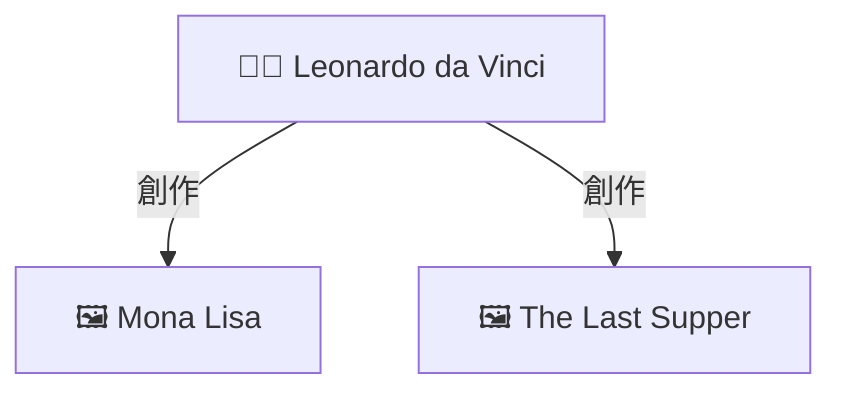

# 🎨 OpenWebUI 圖譜視覺化 - 快速參考卡

## ⚡ 一鍵啟動

```bash
# 測試系統
python test_graph_visualization.py

# 查看演示
open graph_visualization_demo.html
```

## 📁 核心文件

| 文件 | 用途 |
|------|------|
| `enhanced_openwebui_rag_function_v6_with_graph_viz.py` | ⭐ 上傳到 OpenWebUI |
| `test_graph_visualization.py` | 🧪 測試診斷 |
| `graph_visualization_demo.html` | 📊 互動演示 |
| `README_圖譜視覺化.md` | 📖 主要說明 |

## 🚀 3 步驟啟動

### 1️⃣ 測試
```bash
python test_graph_visualization.py
```
✅ 看到 "Neo4j 連接成功" 和圖譜數據

### 2️⃣ 上傳
1. OpenWebUI → Admin Panel → Functions
2. 上傳 `enhanced_openwebui_rag_function_v6_with_graph_viz.py`
3. 啟用函數

### 3️⃣ 測試問答
- 模型: 🚀 **Llama 3.1 70B + Enhanced RAG**
- 問題: **"達文西創作了哪些作品?"**

## 💡 測試問題庫

### 藝術家作品查詢
```
達文西創作了哪些作品?
米開朗基羅的代表作是什麼?
拉斐爾有哪些著名畫作?
```

### 藝術家關係查詢
```
米開朗基羅和拉斐爾有什麼關係?
達文西影響了哪些藝術家?
誰是文藝復興三傑?
```

### 風格時期查詢
```
文藝復興時期有哪些藝術家?
巴洛克風格的特點是什麼?
哪些作品屬於高文藝復興?
```

## 🎨 圖譜符號說明

| 符號 | 含義 |
|------|------|
| 👨‍🎨 方框 | 藝術家 (Artist) |
| 🖼️ 方框 | 藝術品 (Artwork) |
| 🎨 菱形 | 風格 (Style) |
| 📅 菱形 | 時期 (Period) |
| → 創作 | 創作關係 |
| → 影響 | 影響關係 |
| → 屬於 | 歸屬關係 |

## 🔧 快速配置

### 減小圖譜 (更快)
```python
# 第 383 行
for i, node in enumerate(nodes[:10]):  # 20→10

# 第 583 行
graph_data = tools.query_neo4j_graph(entities, max_depth=1)  # 2→1
```

### 禁用圖譜
```python
# 第 63 行
"show_graph": False  # True→False
```

### 修改密碼
```python
# 第 32 行
self.neo4j_auth = ("neo4j", "YOUR_PASSWORD")
```

## 🐛 問題速查

| 問題 | 解決方案 |
|------|----------|
| 圖譜不顯示 | `docker ps \| grep neo4j` → 啟動 Neo4j |
| 連接失敗 | `docker logs art-database-neo4j` → 檢查日誌 |
| 數據庫為空 | 運行數據導入腳本 |
| Mermaid 不渲染 | 更新 OpenWebUI 版本 |
| 查詢太慢 | 減少節點數量或深度 |

## 📊 預期輸出示例

```markdown
## 📝 回答
達文西(Leonardo da Vinci)創作了多件傳世名作...

### 📊 知識圖譜關係圖 (6 個實體, 10 個關係)



### 📚 參考來源
1. [vector@chromadb] (相關度: 0.89)
...
```

## ✅ 快速檢查清單

- [ ] Neo4j 運行中
- [ ] 測試腳本通過
- [ ] 函數已上傳
- [ ] 測試問題有效
- [ ] 圖譜正常顯示

## 📞 獲取幫助

```bash
# 運行診斷
python test_graph_visualization.py

# 查看 Neo4j 狀態
docker logs art-database-neo4j

# 檢查數據
docker exec -it art-database-neo4j cypher-shell -u neo4j -p arthistory123
MATCH (n) RETURN count(n);
```

## 🎯 支持的模型組合

| 模型 | RAG 策略 | 圖譜支持 |
|------|----------|----------|
| Llama 3.1 70B | Enhanced RAG | ✅ 是 |
| Qwen3 30B | Graph RAG | ✅ 是 |
| DeepSeek-R1 32B | Hybrid RAG | ✅ 是 |
| 其他 | Vector Only | ❌ 否 |

## 🔗 相關文檔

- 詳細配置: `OpenWebUI_圖譜視覺化配置指南.md`
- 快速開始: `啟動圖譜視覺化功能.md`
- 項目報告: `OpenWebUI_Neo4j_圖譜視覺化_完成報告.md`
- 主要說明: `README_圖譜視覺化.md`

---

**版本**: v6.0.0 | **日期**: 2025-11-27

**💡 提示**: 保存這份快速參考以便隨時查閱!
