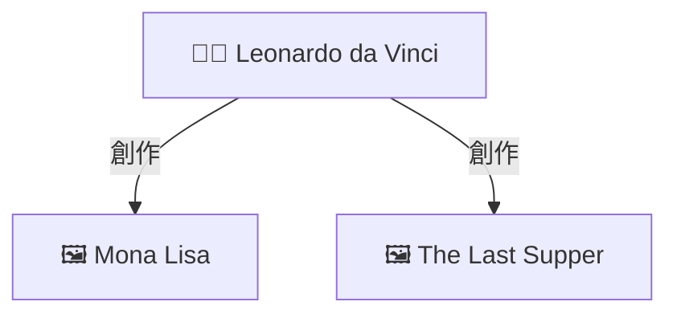

# 🎯 最簡單方案: 修改 Ollama Proxy 添加圖譜

> **不需要 Pipeline, 不需要 Function!** 只需替換一個文件即可!

---

## 📋 方案說明

您現在有 **3 種方案**可選:

| 方案 | 適用場景 | 複雜度 | 推薦度 |
|------|----------|--------|--------|
| **方案 1: 修改 Proxy** ⭐⭐⭐ | 您已經在用 `ollama-rag-proxy.js` | ⭐ 最簡單 | ✅✅✅ 強烈推薦 |
| 方案 2: 使用 Pipeline | Ollama Modelfile 方式 | ⭐⭐ 簡單 | ✅✅ 推薦 |
| 方案 3: 使用 Function | OpenWebUI Function 方式 | ⭐⭐⭐ 複雜 | ✅ 備選 |

**如果您已經在使用 `ollama-rag-proxy.js`,方案 1 是最佳選擇!**

---

## 🚀 方案 1: 修改 Proxy (超簡單!)

### 步驟 1: 備份原文件

```bash
cd art-history-database
cp ollama-rag-proxy.js ollama-rag-proxy.js.backup
```

### 步驟 2: 替換文件

```bash
# 方式A: 直接替換
cp ollama-rag-proxy-with-graph.js ollama-rag-proxy.js

# 方式B: 使用新文件 (保留原文件)
# 無需操作,直接用新文件名啟動
```

### 步驟 3: 修改密碼 (如果需要)

編輯文件,找到第 22 行:

```javascript
this.neo4jAuth = Buffer.from('neo4j:arthistory123').toString('base64');
                                    ^^^^^^^^^^^^^^
                                    修改為您的密碼
```

### 步驟 4: 啟動 Proxy

```bash
# 停止舊的 proxy (如果在運行)
pkill -f ollama-rag-proxy

# 啟動新的 proxy
node ollama-rag-proxy-with-graph.js

# 或者使用原文件名 (如果您替換了)
node ollama-rag-proxy.js
```

### 步驟 5: 配置 OpenWebUI

1. 打開 OpenWebUI: http://localhost:3000
2. 進入 **Settings** → **Connections**
3. 找到 **Ollama API**
4. 修改地址為: `http://localhost:11435`
5. 保存

### 步驟 6: 開始使用!

1. 選擇您的 RAG 模型 (例如: `llama31-graph-rag`)
2. 提問: "達文西創作了哪些作品?"
3. 享受圖譜! 🎉

---

## 🎨 效果展示

### 輸入
```
模型: llama31-graph-rag
問題: 達文西創作了哪些作品?
```

### 輸出

```markdown
達文西(Leonardo da Vinci, 1452-1519)創作了許多傳世名作,包括:

1. 《蒙娜麗莎》(Mona Lisa) - 最著名的肖像畫
2. 《最後的晚餐》(The Last Supper) - 壁畫傑作
3. 《岩間聖母》(Virgin of the Rocks)
...

---

### 📊 知識圖譜關係圖

> **找到 6 個實體, 10 個關係**

> 💡 **圖例**: 👨‍🎨 藝術家 | 🖼️ 作品 | 🎨 風格 | 📅 時期 | 🏛️ 博物館



---

📊 **檢索信息**
- 🔍 RAG 策略: graph_rag
- 💾 資料庫: Neo4j
- 🤖 LLM 模型: llama3.1:8b
- 🕸️ 圖譜視覺化: ✅ 啟用
...
```

---

## ⚙️ 配置說明

### 哪些模型會顯示圖譜?

在新文件的第 25-32 行,您可以看到配置:

```javascript
this.ragStrategies = {
    'vector_rag':   { showGraph: false },  // ❌ 不顯示
    'graph_rag':    { showGraph: true },   // ✅ 顯示
    'hybrid_rag':   { showGraph: true },   // ✅ 顯示
    'enhanced_rag': { showGraph: true },   // ✅ 顯示
    'advanced_rag': { showGraph: true },   // ✅ 顯示
    'agentic_rag':  { showGraph: true },   // ✅ 顯示
    'self_rag':     { showGraph: false },  // ❌ 不顯示
    'naive_rag':    { showGraph: false }   // ❌ 不顯示
};
```

**默認**: `graph-rag`, `hybrid-rag`, `advanced-rag`, `agentic-rag` 會顯示圖譜

**想改?** 修改 `showGraph: true/false`

### 與您的 35 個模型配合

您通過 `create_full_rag_models.sh` 創建的模型:

| 模型名稱 | 圖譜支持 |
|---------|---------|
| llama31-graph-rag | ✅ 自動顯示 |
| llama31-hybrid-rag | ✅ 自動顯示 |
| llama31-advanced-rag | ✅ 自動顯示 |
| llama31-agentic-rag | ✅ 自動顯示 |
| llama31-self-rag | ❌ 默認不顯示 |
| llama31-vector-rag | ❌ 默認不顯示 |
| llama31-naive-rag | ❌ 默認不顯示 |
| ... (其他模型同理) | ... |

---

## 🔧 進階配置

### 調整圖譜大小

在文件中找到 `queryNeo4jGraph` 方法 (約第 270 行):

```javascript
return {
    nodes: Object.values(nodesDict).slice(0, 15),  // 改為 10 或 20
    edges: data[2].slice(0, 30),  // 改為 20 或 40
    ...
};
```

### 修改 Neo4j 連接

在構造函數中 (約第 22 行):

```javascript
this.neo4jUrl = 'http://localhost:7474';  // Neo4j 地址
this.neo4jAuth = Buffer.from('neo4j:your_password').toString('base64');
```

### 為所有模型啟用圖譜

```javascript
this.ragStrategies = {
    'vector_rag':   { showGraph: true },   // 改為 true
    'self_rag':     { showGraph: true },   // 改為 true
    'naive_rag':    { showGraph: true },   // 改為 true
    // ...
};
```

---

## 🐛 故障排除

### ❌ Proxy 無法啟動

**錯誤**: "端口 11435 已被佔用"

**解決**:
```bash
# 找到佔用的進程
lsof -i :11435

# 停止它
kill -9 <PID>

# 或使用不同端口
PROXY_PORT=11436 node ollama-rag-proxy-with-graph.js
```

### ❌ 圖譜不顯示

**檢查清單**:

1. **Neo4j 運行嗎?**
   ```bash
   curl http://localhost:7474
   ```

2. **密碼正確嗎?**
   檢查文件中的 `neo4jAuth` 配置

3. **模型支持嗎?**
   確認模型名稱包含 `graph-rag`, `hybrid-rag` 等

4. **查看 Proxy 日誌**
   ```bash
   # Proxy 啟動時會顯示:
   🕸️ 生成知識圖譜...
      提取的實體: Leonardo da Vinci, Mona Lisa
      ✅ 圖譜已添加 (6 個節點)
   ```

### ❌ OpenWebUI 連接失敗

**解決**:
```bash
# 確認 Proxy 在運行
curl http://localhost:11435/health

# 應該返回 JSON,包含:
# "status": "ok"
# "service": "ollama-rag-proxy-with-graph"
```

---

## 📊 與其他方案對比

### 方案 1 (Proxy) vs 方案 2 (Pipeline)

| 特性 | Proxy 方案 | Pipeline 方案 |
|------|-----------|--------------|
| 適用場景 | 已使用 Proxy | Modelfile 方式 |
| 安裝步驟 | 1步 (替換文件) | 2步 (上傳+配置) |
| 配置方式 | 編輯文件 | UI 配置 |
| 性能 | ⭐⭐⭐⭐⭐ 最快 | ⭐⭐⭐⭐ 很快 |
| 靈活性 | ⭐⭐⭐ 需改代碼 | ⭐⭐⭐⭐⭐ UI 配置 |

---

## ✅ 驗證清單

- [ ] 備份了原 `ollama-rag-proxy.js`
- [ ] 替換或使用新文件
- [ ] 修改了 Neo4j 密碼 (如果需要)
- [ ] 啟動了新 Proxy
- [ ] OpenWebUI 連接到新 Proxy (端口 11435)
- [ ] 測試了支持圖譜的模型
- [ ] 看到圖譜了! 🎉

---

## 🎯 快速命令參考

```bash
# 1. 備份
cp ollama-rag-proxy.js ollama-rag-proxy.js.backup

# 2. 替換 (可選)
cp ollama-rag-proxy-with-graph.js ollama-rag-proxy.js

# 3. 啟動
node ollama-rag-proxy-with-graph.js
# 或
node ollama-rag-proxy.js  # 如果您替換了

# 4. 測試
curl http://localhost:11435/health

# 5. 查看日誌
# Proxy 會實時顯示處理過程
```

---

## 💡 為什麼這是最簡單的方案?

✅ **零學習成本** - 您已經在用 Proxy,只需替換文件
✅ **零配置** - 默認配置開箱即用
✅ **零依賴** - 不需要安裝額外的 Pipeline 或 Function
✅ **完全控制** - 所有邏輯在一個文件中,易於理解和修改
✅ **高性能** - Proxy 直接處理,無中間層

---

## 📝 總結

使用修改後的 Proxy,您的系統架構變成:

```
OpenWebUI
    ↓ (連接到 localhost:11435)
ollama-rag-proxy-with-graph.js
    ↓ (查詢 RAG)
RAG 服務器 (localhost:8010)
    ↓ (查詢圖譜)
Neo4j (localhost:7474)
    ↓ (生成回答)
Ollama (localhost:11434)
    ↓ (返回: 答案 + 圖譜)
OpenWebUI 顯示完整結果!
```

**一個文件解決所有問題!** 🎉

---

**版本**: v2.0.0 | **方案**: Proxy 修改 | **日期**: 2025-11-27

**🚀 開始使用最簡單的圖譜視覺化方案吧!**
